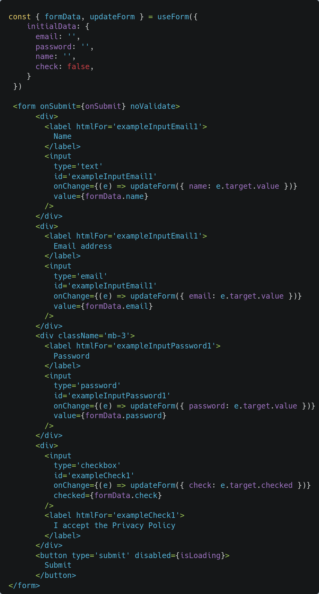
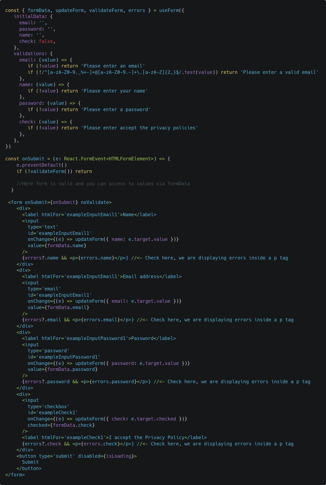
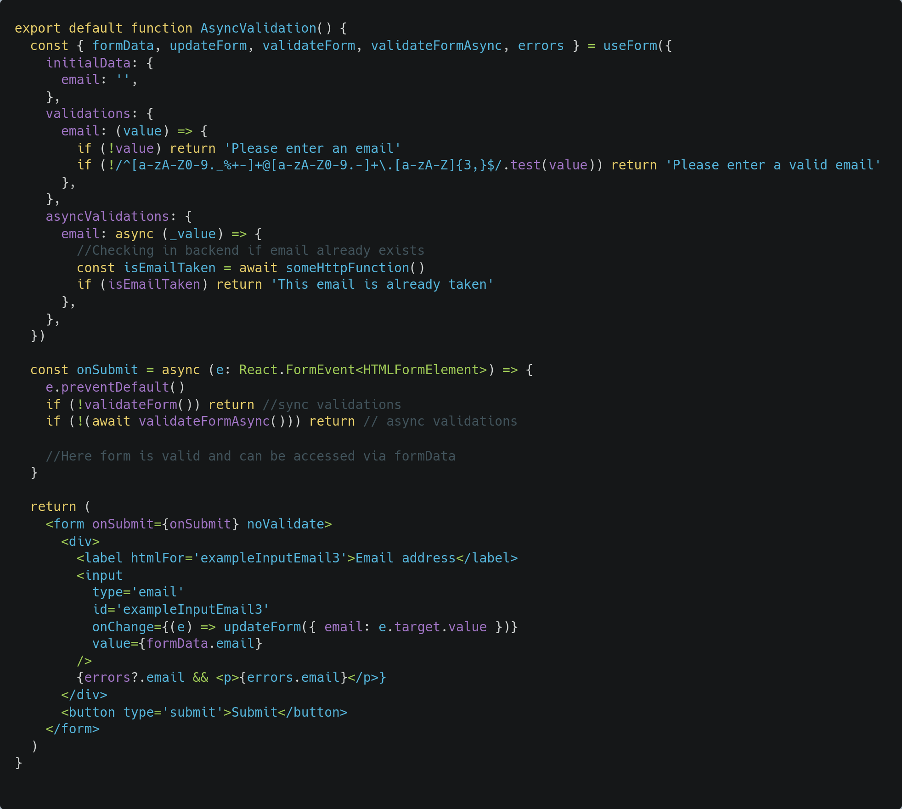
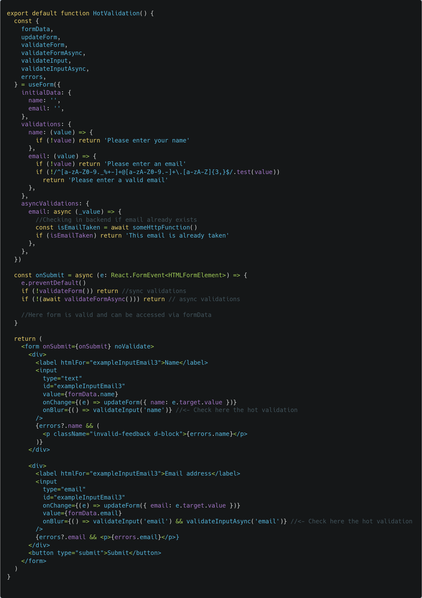
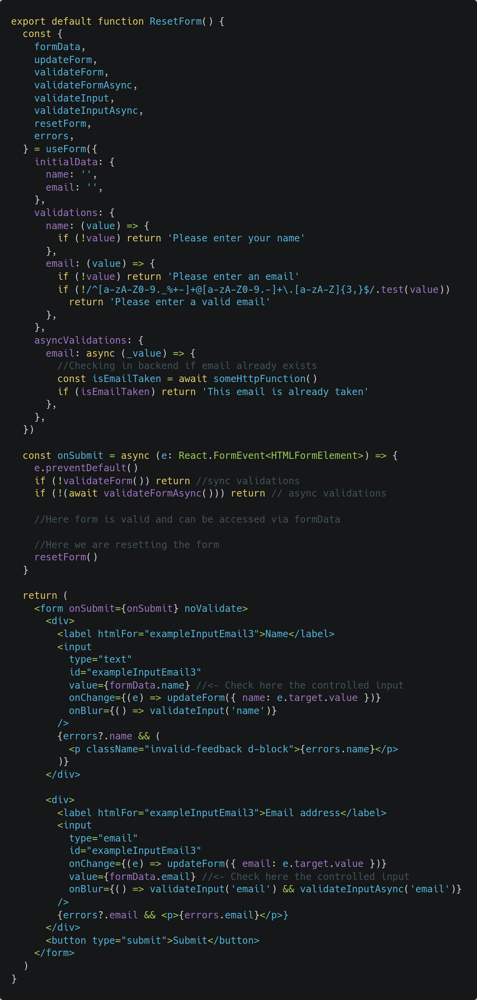
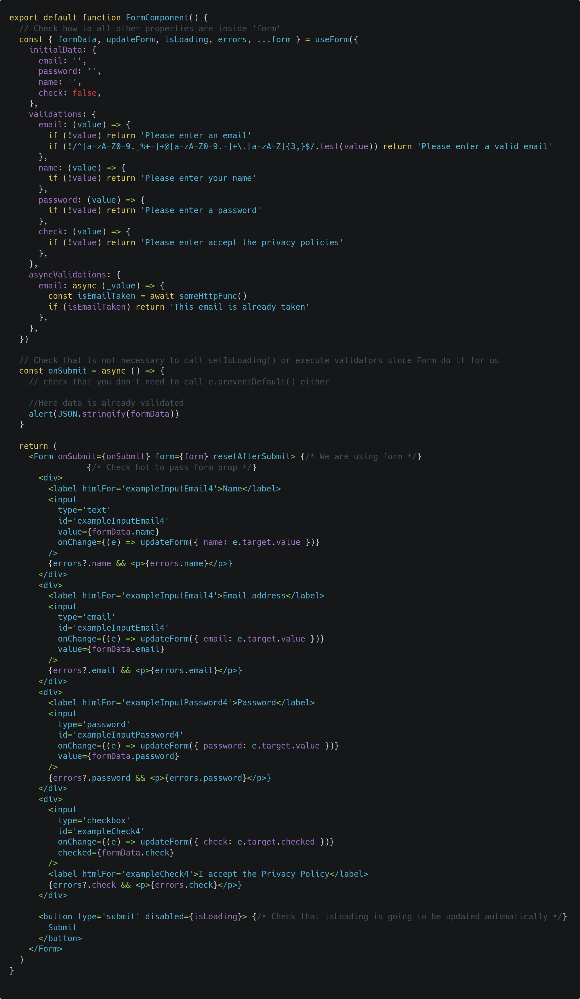

# React Form Ease

React Form Ease is a simple no-option form manager that will help you maintain a clean and tidy state of your forms and their validations.

## Basic Usage  

All you have to do is call the `useForm()` hook, give it some initial data, which will correspond to the fields of your form, and get a function to update it.



## Validations

To create validations, pass a second argument to `useForm()` called validations.
A validator function must be passed for each property that you want to validate, which may or may not return an error message. If an error message is returned, it will be taken as a failed validation and the errors can be recovered in the errors object provided by the hook.
To execute the validations you must call the `validateForm()` function, also provided by the hook, for example in the submit handler.



## Async validations

Sometimes you will need asynchronous validations, for example to check in the backend if an email is already registered or not.
For this type of case you can use the property called `asyncValidations` of the `useForm()` hook, which works exactly the same as validations but they must return a string promise instead of a string, since they must be async functions.
There is also its counterpart `validateFormAsync`, a function that will execute all asynchronous validators and update the error messages corresponding to their validator function.



## Hot validations

All validations are executed manually (usually before processing the data in the submit method), but it can also be executed on the fly, once the user has left an input.
For this we use the `validateInput()` or `validateInputAsync()` functions, in case there is an asynchronous validation for that field.



## Reset form state

You can reset the form via the `resetForm()` method provided by the `useForm()` hook. Only run it once you have used the entered data.
All your inputs will need to be controlled by their value property.



## Loading state

The hook provides a state called `isLoading` and its mutator function `setIsLoading()`.
These are useful in case you want to make an asynchronous process, for example an ajax call with the form data and you need to reflect the wait in the UI, for example disable the submit button or show a spinner.

```TSX
const { isLoading, setIsLoading, formData, resetForm} = useForm({
   ...
})

const onSubmit = (e: React.FormEvent<HTMLFormElement>) => {

   //More code after...

   setIsLoading(true)

   setTimeout(() => {
      alert(JSON.stringify(formData))
      setIsLoading(false)
      resetForm()
   }, 1000)
}

<form>
   {/* ...inputs */}

   <button type='submit' disabled={isLoading}>
        Submit
   </button>
</form>
```

## Form component

React Form Ease provides an optional component called Form, which receives an asynchronous `onSubmit` callback and will perform validations automatically before the callback, as well as set the isLoading state to true until the callback has been resolved. you need to pass the rest of the hook properties that you don't use where you are using the form. If you use Form component, you don't need to call e.preventDefault().
If you want to reset the form after submitting it, you can use resetAfterSubmit prop of Form component.  

This is completely optional, but it can save you a few lines of code.



## Built in validators

React Form Ease comes with pre-built validators with which you can validate common use cases for:
- strings
- numbers
- booleans
- dates  
  
For example you can rewrite this:
```TS
const { formData, updateForm, isLoading, setIsLoading, validateForm, errors, resetForm } = useForm({
    initialData: {
      email: '',
      password: '',
      name: '',
      check: false,
    },
    validations: {
      email: (value) => {
        if (!value) return 'Please enter an email'
        if (!/^[a-zA-Z0-9._%+-]+@[a-zA-Z0-9.-]+\.[a-zA-Z]{2,}$/.test(value)) return 'Please enter a valid email'
      },
      name: (value) => {
        if (!value) return 'Please enter your name'
      },
      password: (value) => {
        if (!value) return 'Please enter a password'
      },
      check: (value) => {
        if (!value) return 'Please accept the privacy policies'
      },
    },
  })
```
like this

```TS
const { formData, updateForm, isLoading, setIsLoading, validateForm, errors, resetForm } = useForm({
    initialData: {
      email: '',
      password: '',
      name: '',
      check: false,
    },
    validations: {
      email: (value) => string(value).required('Please enter an email').email().validate(),
      name: (value) => string(value).required().name().validate(),
      password: (value) => string(value).required().min(4).max(8).validate(),
      check: (value) => boolean(value).required().isTrue('Please accept the privacy policies').validate(),
    },
  })
```

All you have to do is start a validation string with the data type you need to validate, for example string(), number(), boolean() or date() and pass the validated value as an argument.

```TS
validations: {
   email: (value) => string(value)...,
},
```

You can then continue the chain with as many validations as you require. At the end you must finalize the chain by calling the validate() method.

```TS
validations: {
   email: (value) => string(value).required().email().min(5).max(20).validate(),
},
```

Each validator has a predefined error message, but you can pass a custom message as the last argument to each validator.

```TS
validations: {
   email: (value) => string(value).required("Please enter an email").email("Please enter a valid email").min(5, "Al least 5 chars").max(20, "Less than 20 chars").validate(),
},
```

### Combine built in validators and custom validations

You can use the predefined validators and still do more specific validations, for example.

```TS
validations: {
      email: (value) => string(value).required('Please enter an email').email().validate(),
      name: (value) => string(value).required().name().validate(),
      password: (value) => {
        const error = string(value).required().min(4).max(8).validate()
        if (error) return error
        if(value.includes('.')) return '. is forbidden'
      },
      check: (value) => boolean(value).required().isTrue('Please accept the privacy policies').validate(),
}
```